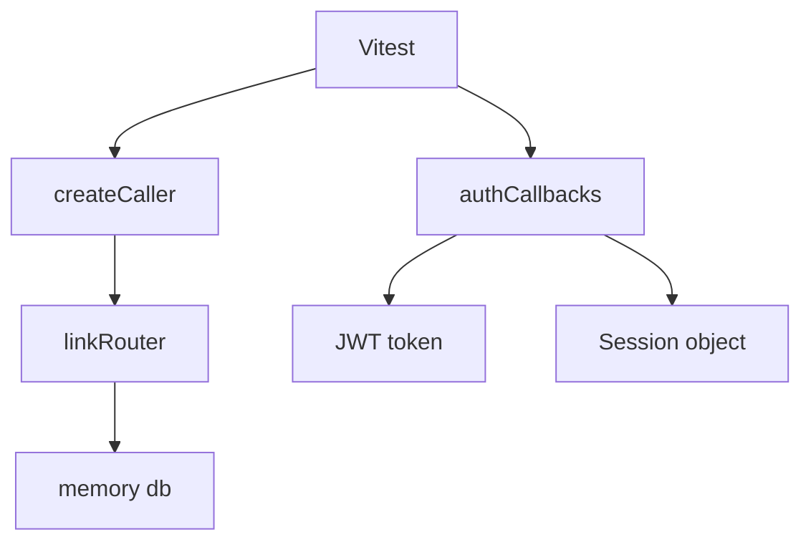

# DESIGN009 – Test Hardening for Link Authorization and Auth Callbacks

## Context
- Existing Vitest coverage exercises happy paths for link mutations but lacks explicit authorization regressions.
- Auth callback behaviour has a gap when `jwt` runs without a `user` object but with a `sub` claim; session propagation also needs verification.
- Requirements reference: Link Authorization Hardening, Auth Callback Consistency (memory/requirements.md).

## Goals
1. Prove link router mutations reject unauthorized users across create/update/delete/reorder flows.
2. Confirm auth callbacks persist identifiers across JWT and session phases when user data is partially missing.

## Non-Goals
- Modifying router implementations or database behaviour.
- Introducing component/UI tests.

## Architecture & Data Flow

- Tests will construct callers with explicit sessions to exercise authorization checks against the in-memory database.
- Auth callback tests will invoke exported functions directly with mocked payloads.

## Interfaces
- `createCaller(context)` with `context: { db, session, headers }`.
- `authCallbacks.jwt(args)` and `authCallbacks.session(args)`.

## Implementation Plan
1. Extend `linkRouter.spec.ts` with helper to create custom caller contexts (sharing `db`).
2. Add authorization-focused test cases covering create, update, delete, reorder for foreign collections/links.
3. Update `authSession.spec.ts` to add scenarios for JWT `sub` fallback and session propagation when no user id provided.
4. Ensure tests reuse seeded IDs from `db.mock` and assert TRPCError codes or mutated state as required.
5. Run Prettier check, ESLint, and Vitest per contribution standards.

## Test Strategy
- Unit-style tests using Vitest.
- Negative assertions verifying thrown TRPCErrors for unauthorized access.
- Direct callback invocation assertions for ID propagation.

## Risks & Mitigations
- **Risk:** Using `createTRPCContext` may always return the mocked user. **Mitigation:** Build manual caller contexts with explicit session overrides.
- **Risk:** Shared memory database state between tests. **Mitigation:** rely on global reset in `src/test/setup.ts` and avoid cross-test dependencies.

## Task Tracking
- Linked task: `TASK011` in `memory/tasks/TASK011-test-hardening.md`.

